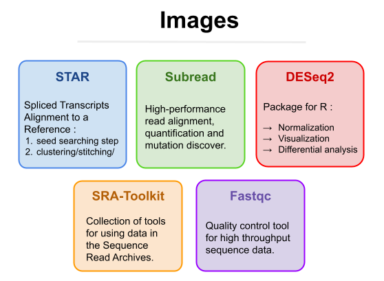
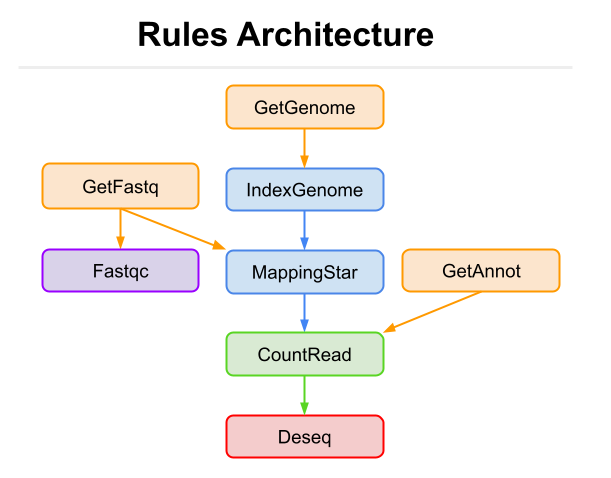

# Project Repro-Hackathon

Project of the Master of Bioinformatics (AMI2B) of the University Paris-Saclay realized by : <br>
* <a href="https://github.com/JudithCo" target="_blank">Judith Coutrot </a> <br>
* <a href="https://github.com/J-ally" target="_blank">Joseph Allyndrée </a> <br>
* <a href="https://github.com/hippolyte456" target="_blank">Hippolyte Dreyfus </a> <br>
* <a href="https://github.com/Aaramis" target="_blank">Auguste Gardette </a> <br>

## Presentation

The goal is to reproduce parts of the analysis described in these papers (to read): <br>
* https://pubmed.ncbi.nlm.nih.gov/23313955/ <br>
* https://pubmed.ncbi.nlm.nih.gov/23861464/ <br>

They performed <a href="https://en.wikipedia.org/wiki/RNA-Seq" target="_blank">RNA-Seq</a> in samples from patients with uveal melanoma. Some samples are mutated in SF3B1 .
We want to analyze this data in order to find <a href="https://en.wikipedia.org/wiki/RNA-Seq#Differential_expression" target="_blank">differentially expressed genes</a>, i.e. genes that are more (or less) expressed in one condition (SF3B1 mutated samples) compared to another (SF3B1 non mutated samples).

## Organization

To do this, we have designed and implemented a reproductible workflow.<br>
* A Directory [Tools](./Tools/) to build all containers (using Singularity) with the tools that will be used in the workflow.
* A Directory [Workflow](./Workflow/) with the rules and files (using Snakemake) needed for the workflow.
* A Directory [Doc] with documents about this project. (TO DO)
* A Script [run.sh](./run.sh) to execute the workflow.
* A [README](./README.md) file

### Images Resumes



### Rules Resumes :



## About IFB Cloud

"French Institute of Bioinformatics ([IFB](https://www.france-bioinformatique.fr/cloud-ifb/)) provides life scientists with a federation of clouds, Biosphere, and bioinformatics cloud services to analyze life science data. Biosphere is used for scientific production in the life sciences, developments, and to support events like cloud and scientific training sessions, hackathons or workshops."

### Setting up a VM

[IFB Cloud Biosphere](https://biosphere.france-bioinformatique.fr/)

For the moment the pipeline work for a VM BioPipes "ifb..mxlarge (16 vCPU, 64Go GB RAM, 400Go local Disk)"

It should also work for a VM of 8 CPUs, below 8 the indexing of the whole genome is impossible. 

## Run the workflow
```bash
./run.sh
```

The report of our work is available here 

