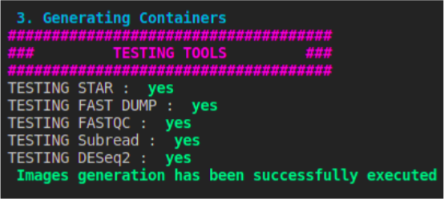

# Tools

## Organization

* One subdirectory per tool containing a script and a README
* A subdirectory for images (absent by default)
* A script "[images.sh](./images.sh)" generating all the images in image's folder
* A [README](./README.md) file

## Images Resume


## Useful links

### Tools
* [FASTQ Dump](https://github.com/ncbi/sra-tools/)
* [STAR](https://github.com/alexdobin/STAR)
* [FASTQC](https://www.bioinformatics.babraham.ac.uk/projects/fastqc/)
* [Subread](https://subread.sourceforge.net/)
* [DESeq2](https://bioconductor.org/packages/release/bioc/html/DESeq2.html)
* [Samtools](http://www.htslib.org/)

### Articles
* [Recurrent mutations at codon 625 of the splicing factor SF3B1 in uveal melanoma](https://pubmed.ncbi.nlm.nih.gov/23313955/)
* [SF3B1 mutations are associated with alternative splicing in uveal melanoma](https://pubmed.ncbi.nlm.nih.gov/23861464/)

## Useful commands

### Install Singularity

For Ubuntu (from the Repo directory) :

```bash
sudo apt-get update

sudo apt-get install -y build-essential libssl-dev uuid-dev libgpgme11-dev \
    squashfs-tools libseccomp-dev wget pkg-config git cryptsetup 
```

```bash
wget https://dl.google.com/go/go1.13.linux-amd64.tar.gz

sudo tar --directory=/usr/local -xzvf go1.13.linux-amd64.tar.gz

export PATH=/usr/local/go/bin:$PATH
```

```bash
wget https://github.com/singularityware/singularity/releases/download/v3.5.3/singularity-3.5.3.tar.gz

tar -xzvf singularity-3.5.3.tar.gz
```

```bash
cd singularity

./mconfig

cd builddir

make

sudo make install
```

### Generate images

For Ubuntu (from the Tools directory) :

```bash
./images.sh
```
Please do not commit images on the git repository.

## Final result

The following text will appear once all the containers are successfully compiled.

