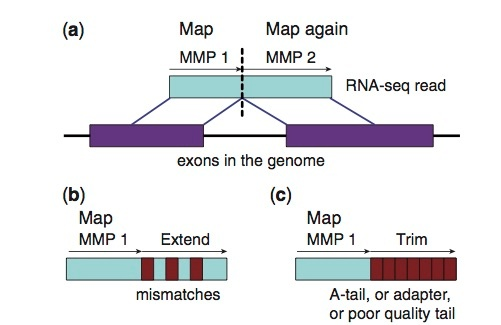

# STAR

## Description


<a href="https://github.com/alexdobin/STAR/blob/master/doc/STARmanual.pdf" target="_blank">STAR</a> '‘Spliced Transcripts Alignment to a Reference" is a faster alternative  for splice-aware read alignment. STAR can align the non-contiguous sequences directly to the genome. The STAR algorithm consists of two major steps: seed searching step and clustering/stitching/scoring step. STAR is more memory intensive (30 gb of RAM required for human genome as compared to ~5 gb required by hisat2), but it is fast.

[<a href="https://www.ncbi.nlm.nih.gov/pmc/articles/PMC3530905/" target="_blank">More information</a>]

## Details



## Build the image
```bash
sudo singularity build star Singularity.star
```

## Execute the image
```bash
singularity shell star
```

##  Check the tool is properly installed
```bash
singularity exec star STAR --help | wc -l | awk ' {if ($0==918) {print "TESTING STAR : \033[1;32m yes \033[0;0m"; exit}{print "TESTING STAR :\033[1;31m no \033[0;0m"}}'
```